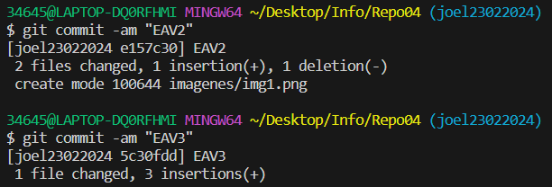
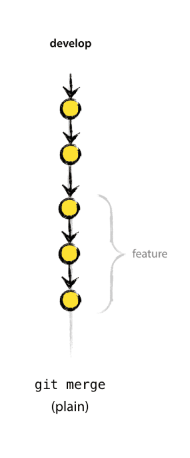

## Ej 4: Fast Forward
1. Crear una rama y ubicate en ella  
  
2. Haz varios commits desde la nueva rama  
  
3. Fusiona la nueva ramacon main  
  
  
4. Haz un push up y elimina la nueva rama  
5. 