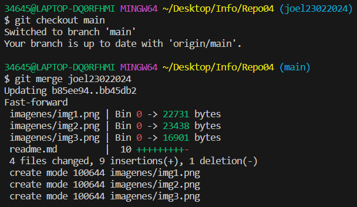
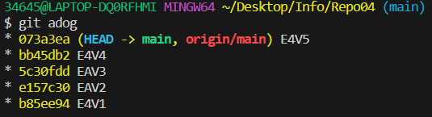
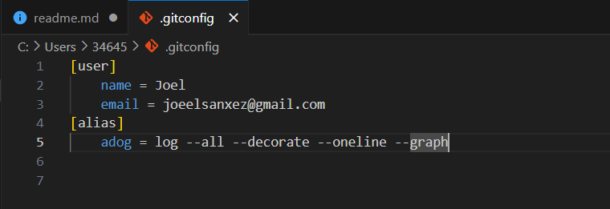
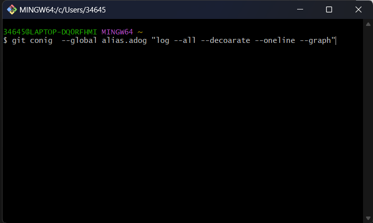

## Ej 4: Fast Forward
1. Crear una rama y ubicate en ella  
  
2. Haz varios commits desde la nueva rama  
  
3. Fusiona la nueva ramacon main  
  
  
4. Haz un git push y elimina la nueva rama  
  
5. Visualiza el resultado  
  
  
***
## Ej 6: Creando un alias
### Por fichero  
  
### Por comando  
  